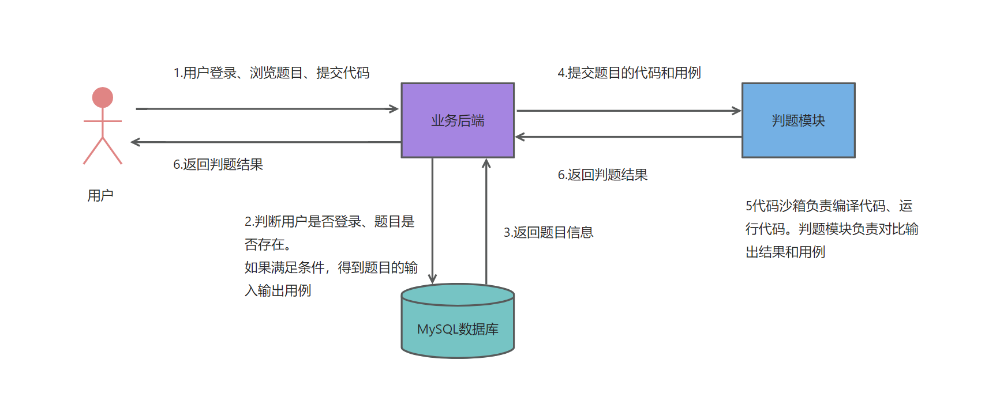
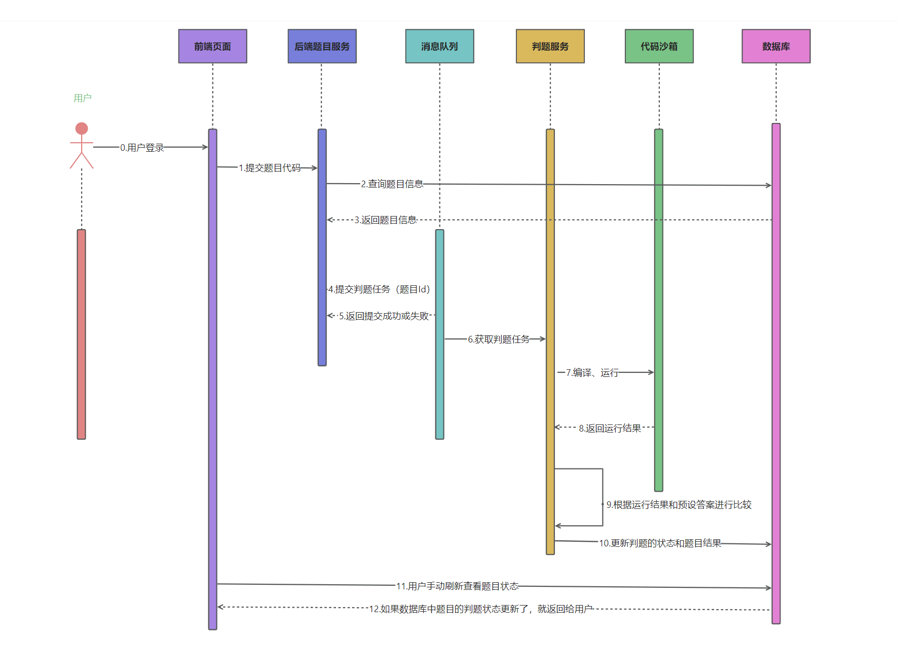
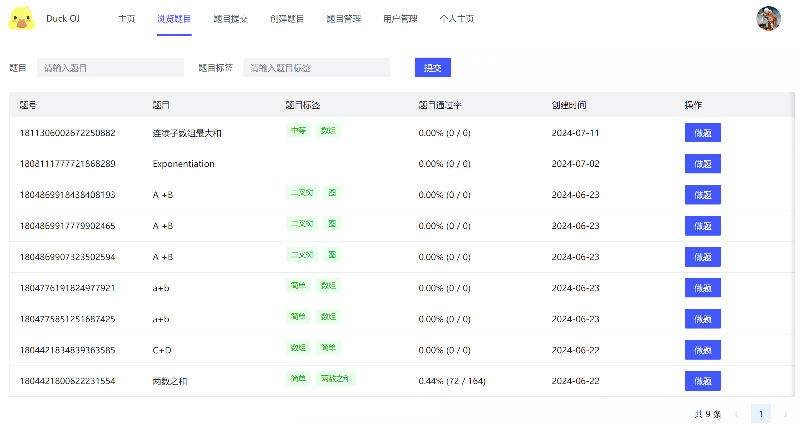
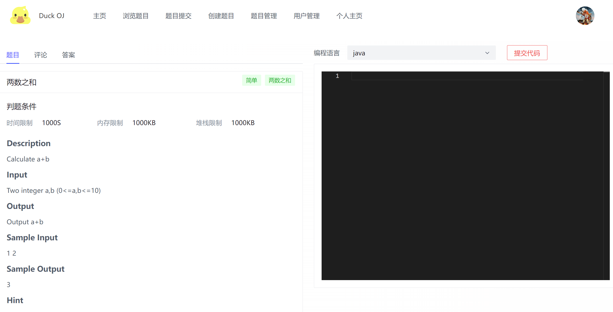
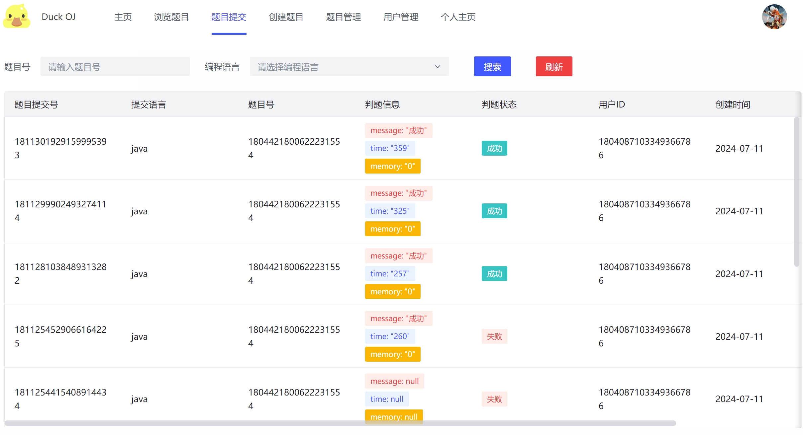
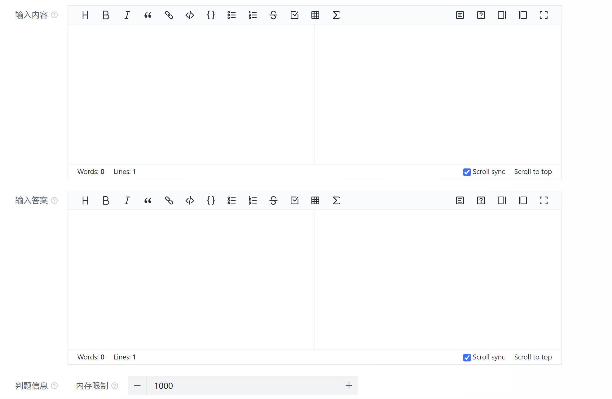
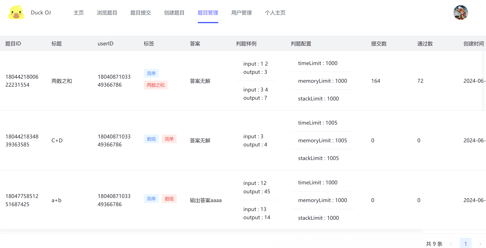
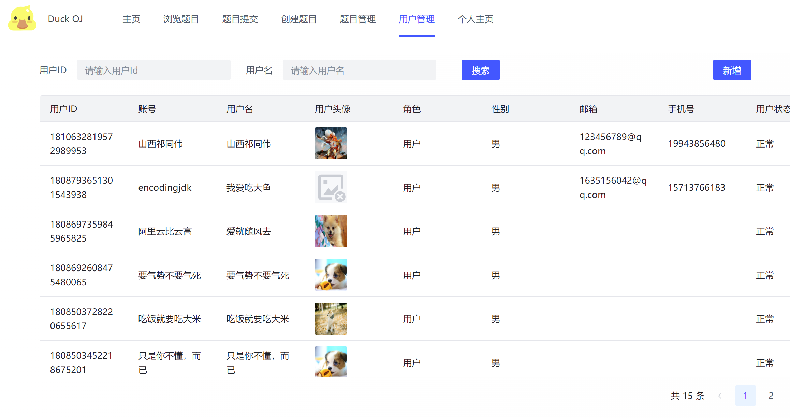
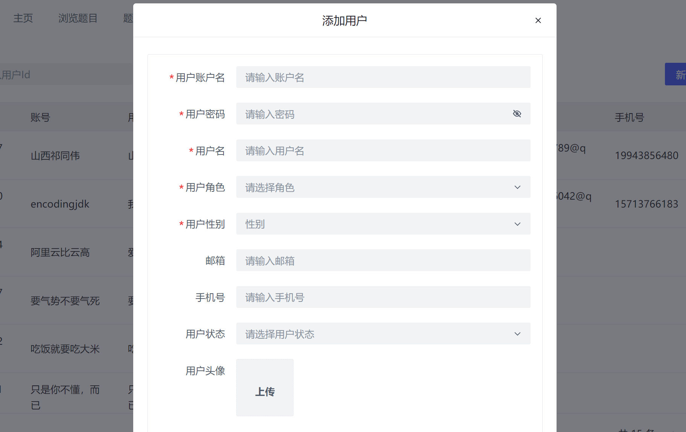
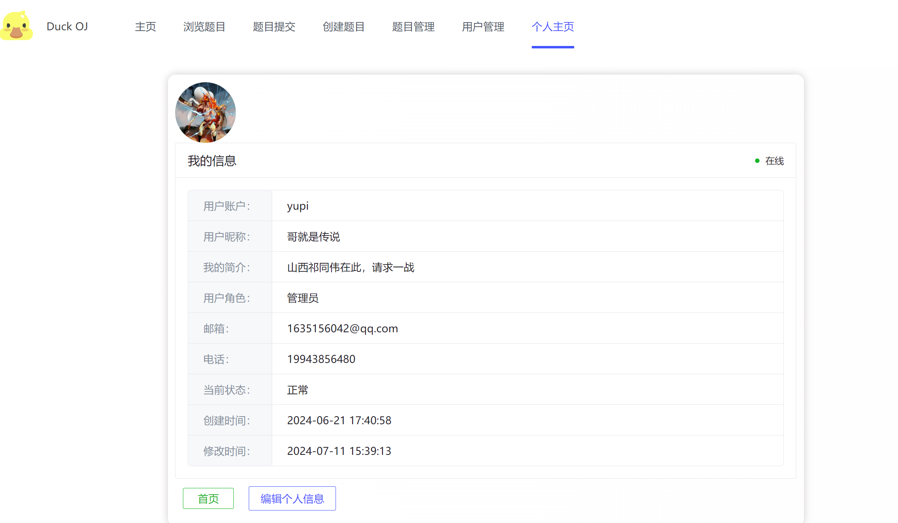

# SpringBoot + Spring Cloud +Nacos + Spring Cloud GateWay+ Vue3  实现在线判题系统

## 业务

### 核心业务逻辑图

### 系统时序图

## 主要内容截图

### 题目浏览

### 做题

### 题目提交

### 创建题目

### 题目管理

### 用户管理

#### 新增

### 个人主页

### 主流框架 & 特性

- Spring Boot 2.7.x 
- Spring Boot 调试工具和项目处理器
- Spring AOP 切面编程
- Spring Scheduler 定时任务
- Spring 事务注解
- Spring MVC
- MyBatis + MyBatis Plus 数据访问（开启分页）
- Spring Cloud
- Spring GateWay
- Nacos

### 数据存储

- MySQL 数据库
- Redis 内存数据库
- Elasticsearch 搜索引擎
- 阿里云 OOS 对象存储

### 工具类

- Easy Excel 表格处理
- Hutool 工具库
- Apache Commons Lang3 工具类
- Lombok 注解

### 业务特性

- Spring Session Redis 分布式登录
- 全局请求响应拦截器（记录日志）
- 全局异常处理器
- 自定义错误码
- 封装通用响应类
- Swagger + Knife4j 接口文档
- 自定义权限注解 + 全局校验
- 全局跨域处理
- 长整数丢失精度解决
- 多环境配置

### 单元测试

- JUnit5 单元测试
- 示例单元测试类

### 架构设计

### MySQL 数据库
